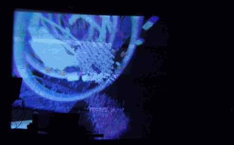
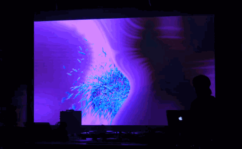
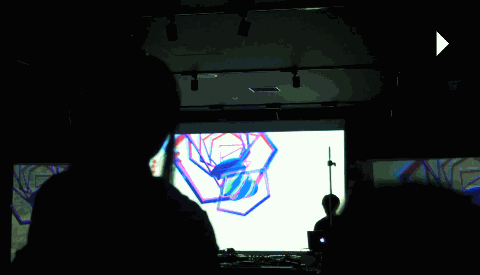
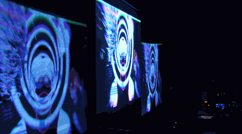

# VJ System for InfiniteRave 09/15/2018

Live visuals for InfiniteRave with [DJ Gaku](https://soundcloud.com/gakunagashima) at [InfiniteRave #1](https://1nfiniterave.peatix.com/)

[(Video)](https://youtu.be/OTTJK_li17s?t=177)

<p>




</p>

(Video by Natsuki Okuda and Rika Ito)

## Requirements

- Unity 2018.2
- Windows
- OBS Studio with obs-ndi plugin
- Atom + [Veda](https://github.com/fand/veda)
- [Arturia Beatstep MIDI Controller](https://www.arturia.com/beatstep/overview) (You could use another MIDI pad, but you would need to reconfigure the MIDI ID's for it to work properly)

## Install

```shell
git clone https://github.com/sp4ghet/vj
git submodule update --init
```

Open in Unity.
